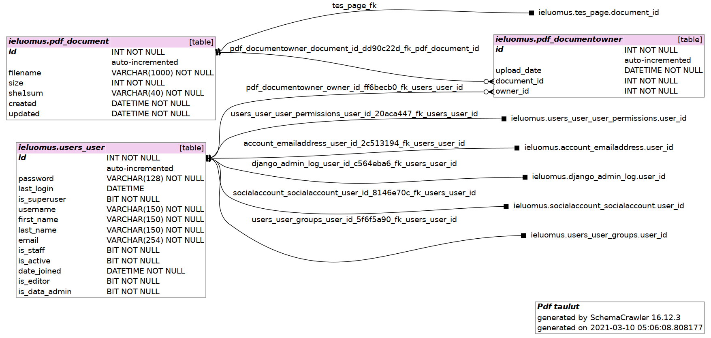

ETIE database
=========

This document contains diagrams and some documentation about ETIE database schema. 

Diagrams are generated with script from an existing database.  

Documentation is kept to a minimum, not detailing every bit.  

pdf
=====

Table ***pdf_document*** contains info about the uploaded pdf-document.  

Table ***pdf_documentowner*** maps document and it's owner/uploader.  

Table ***users_user*** is native to django, linked from above.  

<!-- relative style -->
<!--  -->

masterdata
=====

The application main tables which contain pre-existing information needed for document analysis and information analyzed from the documents.  

tesserakti
=====

Tables here map almost one-to-one from Tesseract tab-separated-values (data) output.  

Recognized regions are part of each other in the logical groups as well as coordinates.  

Order from wider to narrower is ***page>block>paragraph>line>word***.  

pdf_native
=====

TODO: 
<!-- 

 -->
